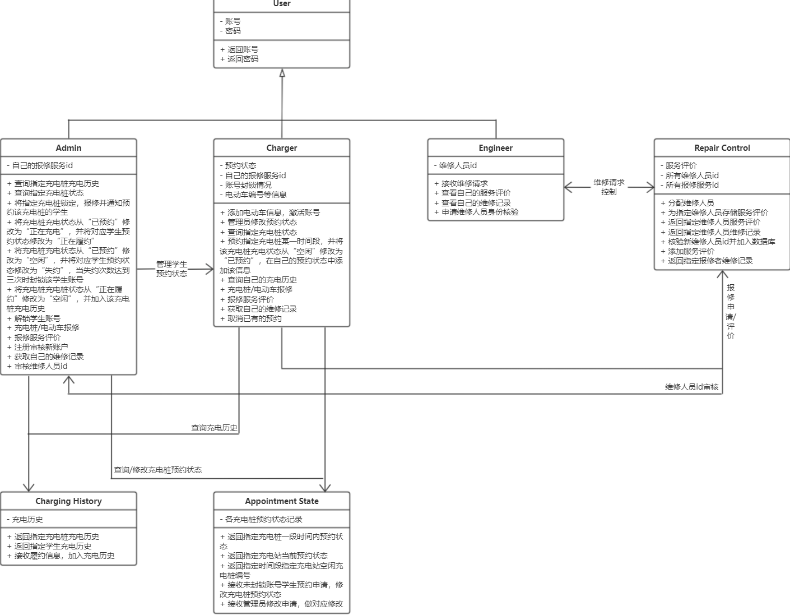

# Charging: Electric Vehicle Charging Station Software
## License
Copyright (C) 此项目为2021 HYSE04小组大作业——电动车珈电站


## 目录

<!--ts-->
- [Charging: Electric Vehicle Charging Station Software](#charging-electric-vehicle-charging-station-software)
  - [License](#license)
  - [目录](#目录)
  - [Git多人协作](#git多人协作)
    - [准备工作](#准备工作)
    - [拉取代码](#拉取代码)
    - [提交代码](#提交代码)
  - [介绍](#介绍)
    - [建模](#建模)
      - [类图](#类图)
      - [用例图](#用例图)
      - [数据建模](#数据建模)
      - [状态转移图](#状态转移图)
  - [项目分工及实现细节](#项目分工及实现细节)
    - [backend/](#backend)
      - [utils](#utils)
      - [User](#user)
      - [Admin](#admin)
      - [Charger](#charger)
      - [Engineer](#engineer)
      - [RepairControl](#repaircontrol)
      - [ChargingHistory](#charginghistory)
      - [AppointState](#appointstate)
    - [frontend/](#frontend)
  - [环境搭建](#环境搭建)
  - [用法](#用法)
    - [输入格式规范](#输入格式规范)
    - [充电者](#充电者)
    - [管理员](#管理员)
    - [维修员](#维修员)
<!--te-->


## Git多人协作

仓库地址：https://github.com/orangeandpuppy/Charging.git

### 准备工作

在本机上安装Git，然后新建一个文件夹（注意路径里不能出现中文），右键选择Git Bash Here，输入以下命令：
```bash
git init
git remote add Charging https://github.com/orangeandpuppy/Charging.git
```
此时输入
```bash
git remote
```
会显示Charging，说明添加成功。

### 拉取代码

```bash
git pull Charging master
```
这样就将远程仓库的代码拉取到本地了。

(注意：在更改代码前，一定要先拉取代码，以免出现冲突)

### 提交代码

```bash
git add .
git commit -m "update"
git push Charging master
```
这样就将本地的代码提交到远程仓库master分支了。
如果提示分支不一致，可以使用
```bash
git checkout -b master
```
切换到master分支。


## 介绍

### 建模
#### 类图

#### 用例图

#### 数据建模

#### 状态转移图


## 项目分工及实现细节
- 项目经理：cyx
- 后端开发：cyx,www,sjg
- 前端开发：zzy,yk
- 测试：cyx,www,sjg,zzy,yk
- 文档：cyx,www,sjg,zzy,yk

### backend/

#### utils
[cyx,www,sjg,zzy,yk]  
把可复用的工具函数放在这里，比如检查输入是否合法等
```
def check_ebike_id(ebike_id: str):
    """
    检查电动车编号是否为合法编号
    :param
        ebike_id: 电动车编号
    :return:
        True/False
    """
```

#### User
[cyx]  
公有属性：无  
公有方法：  
```
def get_id(self):获取用户的id
return: 用户的id(str)
```

```
def get_password:获取用户的密码
return: 用户的密码(str)
```

```
def is_in_db(self):判断该用户是否在数据库中
return: 该用户是否在数据库中(bool)
```

```
def save_to_db(self):保存用户信息到数据库中,如果用户已经存在，则报错
return: 无
```

#### Admin
[sjg]


#### Charger
[cyx]


#### Engineer
[www]


#### RepairControl
[sjg]


#### ChargingHistory
[sjg]


#### AppointState
[cyx]


### frontend/
[yk,zzy]

创建React项目
```
npx create-react-app frontend
```

## 环境搭建

1. 我们建议使用Python 3.9版本，并且强烈建议使用conda进行环境管理。
```
conda create -n Charging python=3.9
conda activate Charging
```
2. 安装依赖
```
pip install -r requirements.txt
```

3.前端需要安装node,npm等工具
node=16.20.2
npm=8.19.4
其他配置见frontend\package.json文件

## 用法

方便测试方使用，暂定

### 输入格式规范
电动车编号格式:（G/X/F）+ 4位数字（0001-9999）（例如：G0001）

### 充电者

### 管理员

### 维修员
